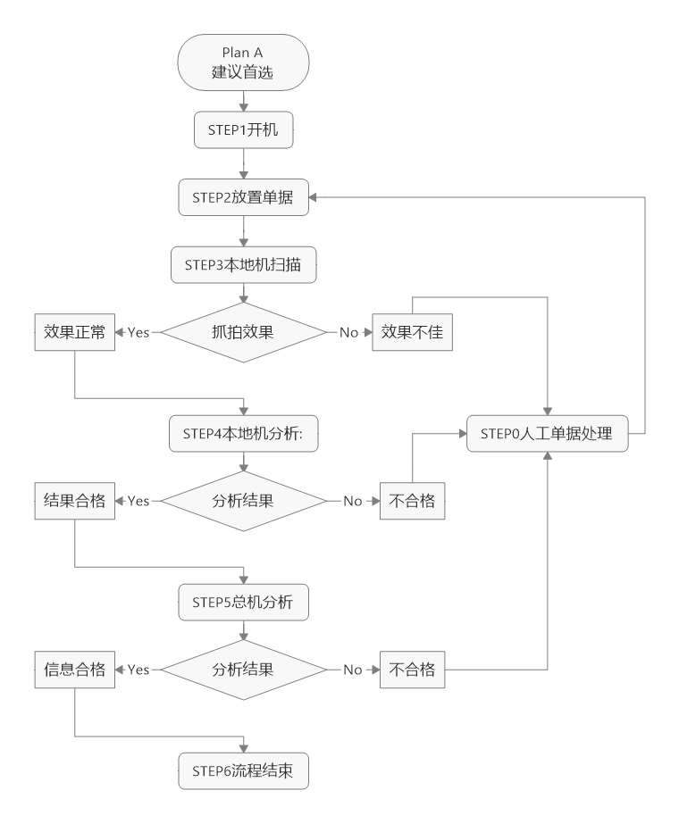
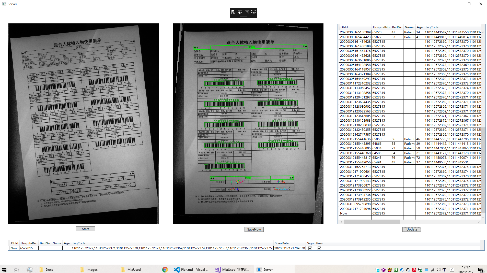
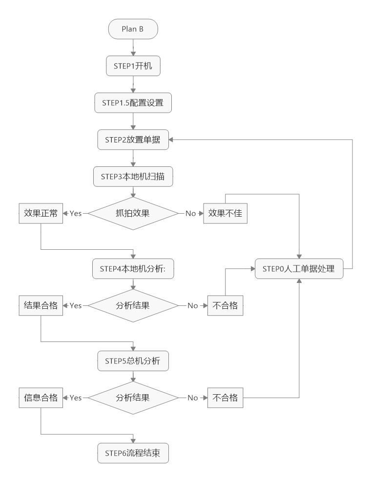
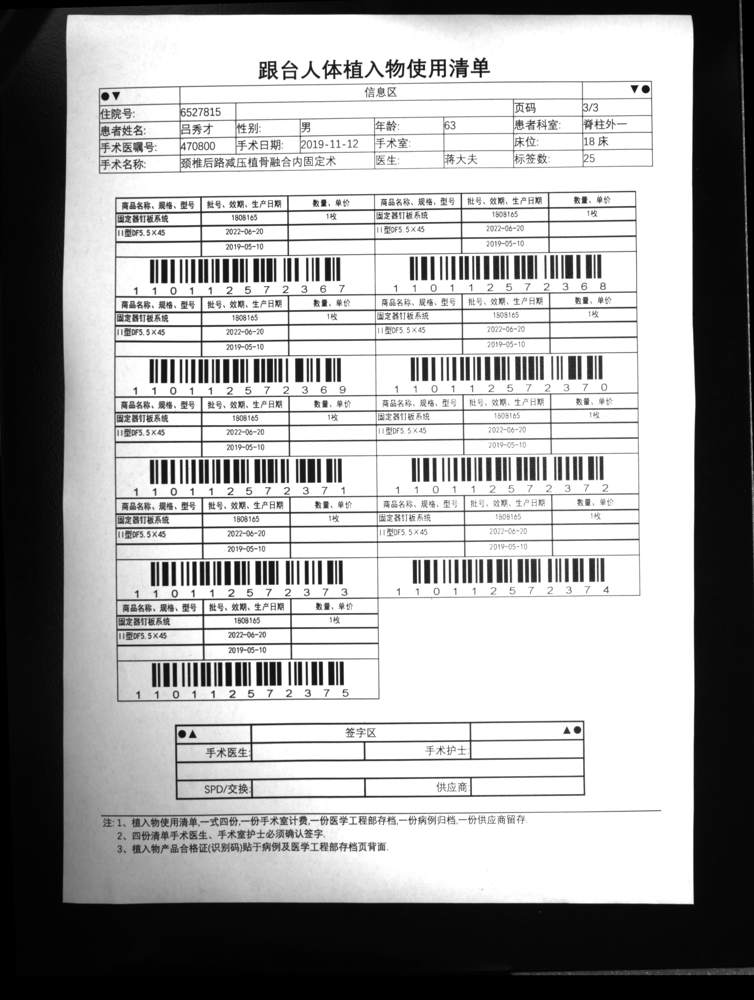

#

# Plan:**需要商定!!!**
## Plan A **建议首选**


### 业务流程

- ```STEP1```开机:本地客户端(放在科室或财会办公室的电脑,下称:"本地机")开机,远程总服务器(放在大型机房的电脑,下称:"总机")端开机
- ```STEP2```放置单据:将单据尽量垂直平直```放置```到翻拍台上;
- ```STEP3```本地机扫描:本地机自动抓拍扫描
  - Yes本地机抓拍效果正常,此时界面闪烁绿色指示灯播放扫描成功音效;跳下一步```STEP4```;
  - No本地机抓拍效果不佳,此时界面闪烁红色指示灯播放扫描失败音效;跳转```STEP2```;
- ```STEP4```本地机分析:自动识别所扫描的单据类型并对扫描内容进行分析处理
  - Yes本地机分析结果合格,本地机界面闪烁绿色指示灯播放扫描合格音效,并自动保存扫描信息;跳下一步```STEP5```;
  - No本地机分析不合格,本地机界面闪烁红色指示灯播放扫描结果不合格音效,跳```STEP0```;
- ```STEP5```总机分析:本地机自动将扫描信息发送到总机
  - Yes总机返回信息合格,则总机和本地机自动保存扫描信息,跳下一步```STEP6```.
  - No总机返回信息不合格,```STEP0```;
- ```STEP6```流程结束:该次业务流程完成,重新开始下一次业务流程;
- ```STEP0```人工单据处理:人工根据电脑提供信息重新核验并修改处理(含信息错误和外表污损褶皱等),跳```STEP2```;
### 特点
- 科室客户端操作简单,耗时较少,
- 识别效率较快
- 识别准确率正常
### 界面展示
- 本地机客户端界面展示
  - 
  - 
    - 左侧:```STEP3```本地机扫描结果
    - 中间:```STEP4```本地机分析结果
    - 右侧:```STEP5```总机分析后存取内容
    - 底部:```STEP4```本地机分析后当前结果
## Plan B 



### 业务流程
- ```STEP1```开机:本地客户端(放在科室或财会办公室的电脑,下称:"本地机")开机,远程总服务器(放在大型机房的电脑,下称:"总机")端开机
- ```STEP1.5```配置设置:本地机```手动设置```要扫描的```单据类型```
- ```STEP2```放置单据:将单据尽量垂直平直```放置```到翻拍台上;
- ```STEP3```本地机扫描:调整单据位置,```手动点击```抓拍;
  - Yes本地机抓拍效果正常,此时界面闪烁绿色指示灯播放扫描成功音效;跳下一步```STEP```4;
  - No本地机抓拍效果不佳,此时界面闪烁红色指示灯播放扫描失败音效;跳转```STEP```2;
- ```STEP4```本地机分析:根据```单据类型```对扫描内容进行分析处理(调取图像分析接口模块)
  - Yes本地机分析结果合格,本地机界面闪烁绿色指示灯播放扫描合格音效,并自动保存扫描信息;跳下一步```STEP5```;
  - No本地机分析不合格,本地机界面闪烁红色指示灯播放扫描结果不合格音效,跳```STEP0```;
- ```STEP5```总机分析:本地机自动将扫描信息发送到总机
  - Yes总机返回信息合格,则总机和本地机自动保存扫描信息,跳下一步```STEP6```.
  - No总机返回信息不合格,跳```STEP0```;
- ```STEP6```流程结束:该次业务流程完成,重新开始下一次业务流程;
- ```STEP0```人工单据处理:人工根据电脑提供信息重新核验并修改处理(含信息错误和外表污损褶皱等),跳```STEP2```;

### 特点
- 科室客户端操作繁琐,耗时较多,
- 识别效率正常
- 识别准确率正常


# 核验单据对象
## 单据类型:**需要商定!!!**
- 跟台人体植入物使用清单
- 高值耗材使用清单
- 东院院区耗材仓库配送出库单
- *物资配送单(低值)*
- *东院院区耗材仓库耗材入库单*
- 等其他单据
- *???*
- 
## 核验内容及核验标准:**需要商定!!!**
- 核验对照文字列表和粘贴条形码:一一对应且与数据库一致即为合格
- 核验识别住院号:信息与数据库一致
- 核验检测签字和盖章:签字区域和盖章区域正常完整无遗漏

## 单据格式:**需要商定!!!**
- 设计要求
  - 签字区域合理易用,不互相影响;签字区域纵向合理间隔;
    - 针对签字粗细大小不同都可以鲁棒适配
  - 各科室统一格式;
  - 设有圆点直线等标志位方便视觉定位扫描;
    - 定位住院号患者名区域和医生签字区域
  - 条码分辨率冗余合理;
  - *???待定:无装订一张(含正反面)*
  - *???待定:住院号及部分待核验内容封装打印为二维码(新增二维码,指二维码和文字共存;方便人工和机器两方核验)*
  - 
- 设计方案
  - 方案示例:
    - 跟台人体植入物使用清单 V2.0(预计后期打改版2次以上)
    - 
## Misc 杂项
### 二维码和条形码
#### 事项
- [ ] 贴条条码和A4打印条码各自生成平台,是否可以自定义模板增删二维码;
## TODO
- [x] 画流程图
- [x] 单据图上图
- [x] 界面截图设计,操作流程
- [ ] 打码平台详细


